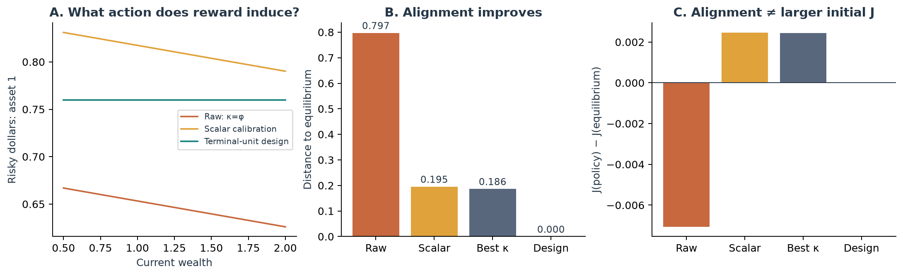
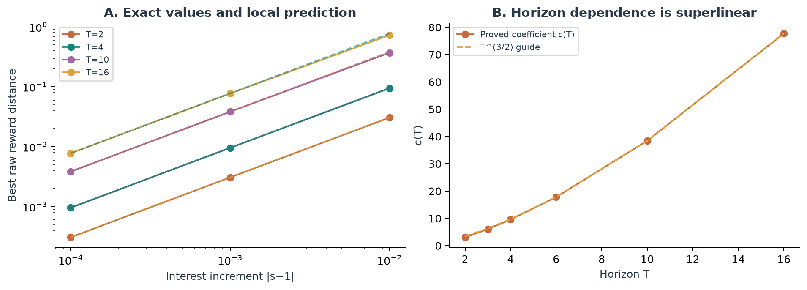
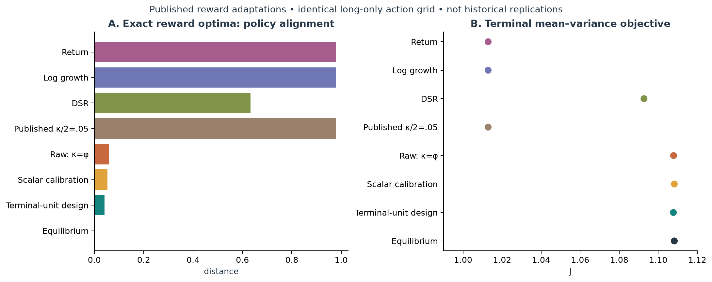
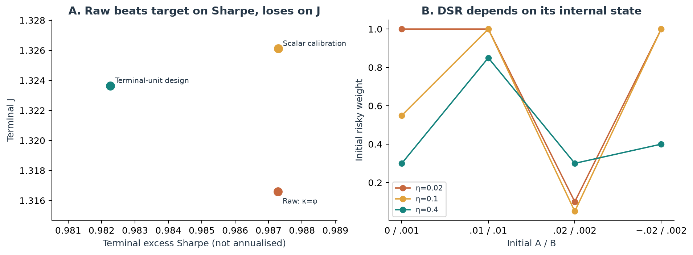

# From portfolio objectives to calibrated RL rewards

Research draft · 22 September 2026 · verified results and explicit open questions

## Abstract

We study the policy induced by additive quadratic wealth-increment rewards relative to terminal mean–variance equilibrium in a controlled discrete-time market. We establish a fixed-horizon local coefficient for the irreducible mismatch of the scalar-penalty family, construct a terminal-unit reward that exactly recovers equilibrium under independent return moments, and derive the missing continuation hedge under observed Markov dependence. Exact and finite-grid comparisons adapt rewards from financial RL papers, while a separate five-seed learning study quantifies optimisation error. We find strong exact alignment improvements but no general improvement in initial mean–variance value, constrained performance or learned financial performance. Existing mean–variance policy iteration reproduces the zero-interest calibration, so this formula is not claimed as a new algorithm. Novelty of the quantitative results remains subject to further prior-art verification.

## Scope and reproducibility

This draft replaces the earlier unqualified surrogate-gap narrative. The paper and proposal share saved experiment data, exact assumptions, figure captions and a version-specific literature ledger. Proofs below establish mathematical claims within the model; they do not certify publication priority. The raw experiment bundle contains all seeds, exact benchmark values and training histories.

| Evaluation object | Meaning |
|---|---|
| Precommitted policy | Initial-date maximiser of J. |
| Equilibrium policy | No profitable one-step deviation by any later self. |
| Reward optimum | Exact optimiser of the chosen additive criterion. |
| Learned policy | Finite-budget output, evaluated as a deterministic affine policy. |


Figure 1 · NUMERICALLY VERIFIED. T=4, φ=1, s=1.02, three risky assets. Reward redesign eliminates exact policy mismatch. Scalar calibration attains a slightly larger initial J than equilibrium: better alignment and larger initial J are different goals.

# 1 · What the closest literature actually does

The gap is not that financial RL ignores objectives or time inconsistency. Several important papers address them directly. The relevant question is how a specified reward’s optimal policy differs from an independently specified terminal-wealth target.

| Paper / exact locator | Objective and method | Role in this project |
|---|---|---|
| Kolm–Ritter (2019), manuscript Eqs. 8–10 | Approximate quadratic increment reward; fitted SARSA hedging. | Closest reward family; explicitly acknowledges covariance/approximation. |
| Jiang et al. (2017), §4.2 Eqs. 21–22 | Log-growth reward; direct gradient portfolio learning. | Alternative preference; not intrinsically a wrong growth reward. |
| Yang et al. (2020), §3.3 Eq. 4; Table 2 | Net value change; PPO/A2C/DDPG; Sharpe ensemble selection. | Return-reward adaptation; separates reward from evaluation criterion. |
| Moody–Saffell (2001), §II-D Eqs. 14–15 | Differential Sharpe; recurrent direct reinforcement. | Augmented-state DSR comparison, not fixed-penalty equivalence. |
| Bisi et al. (2020), §§3–5; Zhang et al. (2021), Algorithm 1 | Per-step mean-volatility; TRVO / MVPI-TD3. | Direct prior reward-transformation theory; MVPI adaptation added. |
| Wang–Zhou (2020), §2 Eq. 11; Dai et al. (2023), working §4 | Objective-specific MV RL; precommitment / log-MV equilibrium. | Positive precedents with analytic references; no first-MV-RL claim. |

Concrete positioning: Kolm–Ritter optimise an explicitly approximate quadratic increment reward for hedging. Jiang et al. choose log growth. Yang et al. train on value increments and select agents by Sharpe. Our benchmark holds the market and feasible set fixed, solves these adapted reward problems, and compares their induced policies with a prescribed mean–variance equilibrium. This tests preference alignment; it does not refute each paper’s own stated objective. [1, 2, 3]

The zero-interest calibration is not a sufficient novelty claim: the finite-horizon iid reduction of Zhang’s MVPI has the same fixed point. Basak–Chabakauri also discuss recovering time-consistent objectives with the same policy, and Björk–Murgoci’s abstract states an associated-control result. The candidate contribution is the explicit quantitative obstruction and its audited removal within a concrete reward family. Priority remains OPEN. [6, 10, 12]

The source ledger records authors, exact titles, venue, identifiers, reward, algorithm, data, reported results, and version-specific locators for every comparison. Eleven primary versions were inspected; one additional source is explicitly abstract-only.

# 2 · Objective, benchmark and calibration procedure

Established analytic scope: finite horizon T, initial wealth x₀, deterministic positive risk-free gross returns sₜ, unconstrained risky dollar holdings uₜ, and independent excess-return vectors Pₜ with means mₜ and positive-definite covariances Σₜ. Gaussian sampling is used for training, but the exact affine moment results only require finite second moments. Long-only weights are treated separately.

```text
Xₜ₊₁ = sₜ Xₜ + Pₜᵀuₜ      J(π) = E[X_T] − φ Var(X_T), φ>0
Mₜ = Σₜ + mₜmₜᵀ     dₜ = Mₜ⁻¹mₜ     νₜ = mₜᵀdₜ < 1
Hₜ = product of sⱼ for j>t      u_eq,t = Σₜ⁻¹mₜ / (2φHₜ)
```

Li–Ng supply the precommitted reference; equilibrium control follows consistent planning. Our redesign targets equilibrium. If initial-date performance is the intended objective, use the precommitted benchmark and an appropriate terminal objective instead. [9, 10, 7]

## A reward-design rule with an explicit guarantee

```text
Yₜ = Hₜ Pₜᵀuₜ
r_design,t = Yₜ − φ(1−νₜ)Yₜ²
```

PROVED: conditional expected reward is strictly concave in uₜ, wealth-independent, and maximised at u_eq,t. Independence and unconstrained actions make these pointwise maximisers globally optimal for the additive reward. Scaling gains into terminal units removes the interest-driven obstruction of the original wealth-increment reward. Time-varying moments require date-specific calibration.


Figure 2 · NUMERICALLY VERIFIED. Existing MVPI adaptation agrees at zero interest but targets per-step mean-volatility away from it. With changing moments at zero interest, a common scalar penalty leaves distance 0.067715; the date-specific design gives zero.

Implementation procedure: estimate or specify moments; declare the target and constraints; solve the exact reward problem where possible; report distance and terminal J; optimise reward parameters using a fixed reference occupancy; then train with the resulting reward and report its optimisation error separately.

# 3 · Theoretical contribution and its boundaries

## R2 · The irreducible raw-reward mismatch — PROVED

For iid returns set d=M⁻¹m, ν=mᵀd and b=1/[2φ(1−ν)]. Assume m≠0 and fixed T≥2. For r=ΔX−κ(ΔX)², let D be the square root of summed expected squared action differences along the reward policy. Then, locally around s=1:

```text
min over κ>0 D(πκ,πeq) = c_T |s−1| + O((s−1)²)
c_T = ||d|| b √[T(T²−1)/3 + ν(1−ν)T(T−1)/2]
```

At zero interest exact matching requires κ=φ(1−ν). At nonzero interest and T≥2 the final reward-optimal policy has wealth slope −d(s−1), while equilibrium has zero slope and reachable wealth has positive variance. No scalar κ removes that difference. The statement concerns this reward family, not all additive rewards.

The proof closes the earlier remainder and minimisation gaps: write h=1/(2κ); policy intercepts and controlled wealth are affine in h, so D² is exactly quadratic in h. Its coefficients are analytic in s−1 and its unique minimum remains interior near zero. This establishes the expansion after minimisation. At large fixed-parameter T, c_T grows as T^(3/2); this is not a joint uniform small-interest/large-horizon theorem.


Figure 3 · PROVED coefficient with NUMERICALLY VERIFIED finite-interest checks. Solid curves show exact calibration and dashed curves the local prediction. The earlier “approximately linear in horizon” claim is withdrawn.

## R4 · Changing moments and a common penalty — PROVED

```text
At sₜ=1: min D² = Σₜ aₜ(bₜ−b̄)²
aₜ=||dₜ||², bₜ=1/[2φ(1−νₜ)], b̄=(Σₜaₜbₜ)/(Σₜaₜ).
```

The lower bound is positive exactly when bₜ varies across positive-weight dates. Time variation by itself is insufficient. Degenerate zero means, the positivity condition for one-period matching, and the local nature of the theorem are retained in the proof appendix.

# Proof appendix · second moments and exact recursion

E[d_t-kappa*d_t²]=E[d_t]-kappa Var(d_t)-kappa E[d_t]². Calling this simply a variance penalty hides an additional squared-mean penalty. A conditional-variance reward m'u-phi*u'Sigma*u has a different optimum. Much of the zero-interest calibration follows immediately from this distinction and Sherman–Morrison; it must not be sold as an unexplained failure of Bellman optimisation.

## Proof appendix · 2. Existing recursion and exactness

Let W_t(x)=p_t x²+q_t x+c_t and g_t=kappa(s_t−1)−p_next*s_t. Completing the square yields

```text
alpha_t = −d_t*g_t/(kappa−p_next)
beta_t  = d_t*(1+q_next)/[2(kappa−p_next)]
p_t = [kappa*p_next−(1−nu_t)*g_t²]/(kappa−p_next)
1+q_t = (1+q_next)*(s_t−nu_t*g_t/(kappa−p_next)),
p_T=q_T=0.
```

The constant c_t does not affect actions. For the quadratic increment reward, Bellman maximisation has Hessian -2(kappa-p_next)M. The recursion gives p<=0 by induction. Thus it maximises over all admissible Markov actions, not just an affine search class. At s=1 the optimum is d/(2kappa); the equilibrium is Sigma^{-1}m/(2phi)=d/[2phi(1-nu)]. Equality iff kappa=phi(1-nu) when m!=0. If m=0 both are zero for every kappa.

For T=1, equality refers to the initial action, not equality of functions on all wealth values. It requires 1/[2phi(1-nu)]+(s-1)x0>0; otherwise no positive finite kappa matches (m!=0).

# Proof appendix · 3. General horizon small-interest theorem, including the remainder

Let m,Sigma be constant, T>=2 fixed, s=1+e, and b=1/[2phi(1-nu)]. Use the ORIGINAL one-sided occupancy discrepancy D²=sum E_{pi_k}||pi_k(t,X_t)-pi_eq(t,X_t)||². It is a discrepancy, not a symmetric metric.

Then, for sufficiently small |e|,

```text
min_{kappa>0} D = c_T |e| + O(e²),
c_T = ||d|| b sqrt[T(T²-1)/3 + nu(1-nu)T(T-1)/2].
```

This proves the previous general-horizon conjecture and supplies its constant. For T=2 the bracket is (2-nu)(1+nu). As T tends to infinity with other parameters fixed, c_T ~ ||d|| b T^(3/2)/sqrt(3). This is not a uniform joint limit in e and T.

Proof. Divide p by kappa in the recursion. p/kappa and q, hence alpha, are independent of kappa; beta is linear in h=1/(2kappa). The controlled wealth on any common return path is X_t=L_t(e)x0+h Z_t(e). Therefore the squared discrepancy F(e,h) is exactly a quadratic polynomial in h. Its coefficients are analytic near e=0, since the finite backward recursions have nonzero denominators there, and moment propagation uses only finite second moments. At e=0, F(0,h)=T||d||²(h-b)². The h² coefficient is strictly positive; hence the global unconstrained minimiser h*(e) is analytic and stays positive near zero. It is also the global minimiser over h>0. This justifies minimisation and the uniform local Taylor expansion rather than assuming that a fitted local optimum is global.

Write kappa=phi(1-nu)(1+w e). Uniformly for bounded w, alpha_t=-d e+O(e²), beta_t=d b[1+((T-t-1)(1-nu)-w)e]+O(e²), and beta_eq,t=d b[1-(T-t-1)e]+O(e²). At e=0 the common policy is d b, giving E[X_t]=x0+t nu b and Var(X_t)=t b² nu(1-nu). The leading action difference divided by d e is -X_t+b[(T-t-1)(2-nu)-w]. Its means form an arithmetic progression with step -2b. The minimising w is (T-1)(1-nu)-x0/b. After centring, the means are b(T-1-2t). Summing their squares gives b² T(T²-1)/3; summing variances gives b² nu(1-nu)T(T-1)/2. Analyticity yields min F=c_T² e²+O(e³). Since c_T>0, its square root has remainder O(e²). QED.

The same leading coefficient holds under fixed equilibrium occupancy, because at e=0 the occupancies agree and only zeroth-order moments enter the leading quadratic term. Away from e=0 these are different discrepancies and must be labelled.

For m!=0, s!=1, T>=2 no exact matching along the surrogate occupancy is possible: equality at t=0 forces a nonzero equilibrium action, hence positive next-wealth variance. Every subsequent nonzero equilibrium action preserves positive variance. At the final date surrogate slope is -d(s-1) while equilibrium slope is zero, contradicting equality almost surely. This obstruction concerns the RAW increment family, not all additive rewards.

No global bound D<=C(|kappa-kappa0|+c|s-1|) with constant C over all kappa>0 follows: at s=1, D= sqrt(T)||d|| |1/(2kappa)-b| diverges as kappa tends to zero while the proposed right side stays bounded. A local bound on compact positive penalty sets is valid by smoothness.

# Proof appendix · 4. Time-varying independent returns: exact reward redesign

Let H_t=product_{j=t+1}^{T-1} s_j (empty product 1). The equilibrium policy is

```text
u_eq,t = Sigma_t^{-1}m_t/(2phi H_t).
```

Proof: under future deterministic holdings, X_T=H_t(s_t x+P_t'u)+future gains. Independence removes action-dependent covariance with future gains. The one-step objective has u-dependent part H_t m_t'u-phi H_t² u'Sigma_t u, strictly concave, giving the displayed action. Backward induction establishes deterministic equilibrium holdings.

Define Y_t=H_t P_t'u_t and

```text
r_design,t = Y_t - phi(1-nu_t) Y_t².
```

Each conditional reward is strictly concave in u and independent of wealth. Exogenous independent returns and unconstrained actions mean pointwise maximisation at every time globally maximises the additive expectation, even over history-dependent policies. Its optimum is d_t/[2phi(1-nu_t)H_t]=u_eq,t. QED.

This removes the raw-reward interest obstruction by measuring excess gains in terminal units and applying time-dependent calibration. It reproduces EQUILIBRIUM, not the pre-committed optimum. An alternative conditional-variance reward Y_t-phi H_t² u'Sigma_t u has the same conditional maximiser. The redesign is model-based and requires moments and the intended target. It is not a universal improvement in J: a different policy may beat equilibrium at time zero.

At all s_t=1, a common raw kappa matches iff every nonzero-mean date has equal nu_t and kappa=phi(1-nu_t). For fixed reference occupancy (all policies here deterministic holdings), write a_t=||d_t||² and b_t=1/[2phi(1-nu_t)]. The squared distance is sum a_t(h-b_t)². Its exact minimum is sum a_t(b_t-b_bar)², with b_bar=sum a_t b_t/sum a_t. This is a positive lower bound iff the b_t vary over positive weights. Time variation alone does NOT imply an unavoidable mismatch (nu_t can remain constant).

# Proof appendix · 5. Predictable Markov returns and the missing hedge

For a scalar excess return P and observed finite regime z, specify the JOINT conditional law of (P,z_next). Rates are deterministic. Let equilibrium terminal mean continuation be f_next(x,z')=H_t x+a_next(z'). Its conditional variance is independent of wealth. The current action-dependent variance is H_t² Var(P|z)u²+2H_t Cov(P,a_next(z_next)|z)u. Consequently

```text
u_eq(t,z)=m_z/[2phi H_t variance_z]
          -Cov(P,a_next(z_next)|z)/[H_t variance_z].
```

Backward propagation of conditional first/second moments establishes the formula. Positive conditional return variance makes it a strict global one-step maximum. A statewise substitution kappa=phi(1-nu_z) produces only the first term; a nonzero hedge covariance defeats that substitution even at zero interest.

An equilibrium-informed additive reward is

```text
r = Y-phi(1-nu_z)Y²
    -2phi Cov(P,a_next|z) H_t u,
Y=H_t P u.
```

Conditional derivative gives exactly u_eq. Because exogenous transitions and this reward do not depend on wealth, its pointwise maximisers globally maximise the sum. This is an inverse-control construction using an already solved continuation, not a model-free shortcut or novelty claim. The useful test is the quantified failure of local calibration and the recovered hedge. Regime-switching MV itself is established literature.

# Proof appendix · 6. DSR: what can actually be concluded

With A'=A+eta(rho-A), B'=B+eta(rho²-B), V=B-A²>0,

```text
V'=(1-eta)V+eta(1-eta)(rho-A)²>0,  0<eta<1.
```

For bounded returns |rho|<=R, finite T, and V0>0, V_t >= (1-eta)^t V0>0 and the DSR is bounded over the reachable finite-horizon state set. Thus an augmented state including market predictors, previous holdings if costs apply, wealth, A and B supports ordinary finite-horizon Bellman recursion. No infinite-horizon fixed-point result follows without additional assumptions.

The unscaled differential Sharpe signal is D=[B(rho-A)-A(rho²-B)/2]/V^(3/2). The legacy code multiplies this by eta, which leaves the policy optimum unchanged for one fixed eta, but changes reported reward units. Its local identity is D=(B/V^(3/2))[rho-(A/(2B))rho²-A/2]. This is only a one-step identity. A,B depend on previous actions, the positive scale is state-dependent, and the continuation value depends on their updates. It does NOT make the optimal dynamic policy a fixed-kappa quadratic policy. A<0 also gives a negative effective penalty. No constant implied terminal risk aversion has been proved.

For iid rho with finite variance sigma², a fixed eta EWMA satisfies limiting Var(A_t)=eta*sigma²/(2-eta)>0. It is not a consistent estimator. Its expectation tends to the mean; its realisation does not converge in probability to it. This disproves the legacy consistency claim. The corrected bounded-tree experiment solves the augmented reward exactly on a finite action set and tests eta/initialisation sensitivity without asserting an unrestricted optimum.

# Proof appendix · known benchmarks and MVPI

For iid nu, deterministic risk-free growth S=product s_t and initial x0,

```text
J_pre=S*x0+[(1-nu)^(-T)-1]/(4phi),
J_eq =S*x0+T*nu/[4phi(1-nu)].
```

The first follows from the Li–Ng embedding or completing the efficient-frontier square; the second follows by summing independent equilibrium gains in terminal units. Their difference proves the 1/phi scaling and independence of x0. These are consequences of known mean–variance solutions, not claimed new.

Signed telescoping J differences must be accompanied by nonnegative surrogate regret J_r(pi_r)-J_r(pi_hat). Sharpe means terminal EXCESS gain over x0*product s_t divided by terminal wealth standard deviation; it is not an annualised backtest Sharpe.

## Proof appendix · 8. Existing MVPI transformation subsumes zero-interest scalar calibration

Zhang, Liu and Whiteson (2021), Algorithm 1, uses r_hat=(1+2phi*y)r-phi*r² with y equal to the occupancy mean reward. In our finite-horizon uniform-time adaptation, s=1 and iid returns give deterministic identical holdings u_n=d*h_n after each exact inner solve. Then y_n=m'u_n=nu*h_n, so h_{n+1}=1/(2phi)+nu*h_n. Because 0<=nu<1, the iteration converges to h*=1/[2phi(1-nu)], precisely the scalar-calibrated equilibrium. This is an elementary reduction of existing MVPI, not a new learning method. For nonzero interest, the implemented iteration remains a fixed-point method for a per-step mean-volatility objective; its numerical convergence does not establish a global optimum or terminal-MV equilibrium.

# 4 · Fair comparison with published reward designs

NUMERICALLY VERIFIED: a separate long-only benchmark has T=3, x₀=1, s=1.02, one risky excess return −.18 or .30 with equal probability, zero costs, and a common 21-point weight grid in [0,1]. Bellman recursion exhaustively solves each finite reward tree. DSR state includes A and B. A one-step-game recursion solves the equilibrium on the same grid. The 11-point grid is also run.


Figure 4 · Adaptations of published formulas, not replications of their data, algorithms or reported performance. κ/2=.05 is a unit-sensitive coefficient copied from the Kolm–Ritter example and is shown only as a sensitivity diagnostic.

| Adapted reward | Distance | Terminal J | Excess Sharpe |
|---|---|---|---|
| Value change | 0.97894 | 1.012819 | 0.39950 |
| Log growth | 0.97894 | 1.012819 | 0.39950 |
| DSR | 0.63257 | 1.092687 | 0.43313 |
| Published .05 diagnostic | 0.97894 | 1.012819 | 0.39950 |
| Raw κ=φ | 0.05848 | 1.107849 | 0.43275 |
| Scalar calibration | 0.05313 | 1.108217 | 0.43368 |
| Terminal-unit design | 0.04137 | 1.107729 | 0.43138 |
| Grid equilibrium | 0.00000 | 1.108204 | 0.43369 |

The design improves alignment over raw and scalar rewards in this configuration, but has slightly lower J than either. It does not exactly recover the constrained equilibrium: wealth-dependent feasible dollar holdings invalidate the unconstrained proof. Return and log-growth policies pursue different preferences, so their terminal-MV rankings are not evidence that they fail at their own tasks.

DSR uses η=.1, A₀=.01, B₀=.01 here. Sensitivity tests vary all three. Reward shapes are transferred; PPO/DDPG, RRL, trading costs, historical datasets and original train/test protocols are not reproduced. Algorithms cannot be ranked from this experiment.

# 5 · Exact values, dependent returns and DSR

| Independent benchmark | Policy distance | Terminal J | Excess Sharpe |
|---|---|---|---|
| Precommitted reference | 3.312087 | 1.425799 | 1.171951 |
| Equilibrium | 0.000000 | 1.323644 | 0.982266 |
| Raw κ=φ | 0.797127 | 1.316580 | 0.987285 |
| Scalar calibration | 0.195347 | 1.326115 | 0.987292 |
| Best scalar in raw family | 0.186435 | 1.326093 | 0.987292 |
| Terminal-unit design | 0.000000 | 1.323644 | 0.982266 |

NUMERICALLY VERIFIED: T=4, φ=1, s=1.02. Distance falls from .797127 to .195347 after zero-interest scalar calibration and to numerical zero after redesign. Raw reward has higher excess Sharpe than equilibrium (.987285 vs .982266), but lower J (1.316580 vs 1.323644). Sharpe uses excess terminal gain over x₀s^T and is not annualised.

## R5 · Dependence introduces an intertemporal hedge — PROVED

```text
u_eq(t,z) = m_z/(2φHₜ Var(P|z))
              − Cov(P,a_next(z_next)|z)/(Hₜ Var(P|z))
```

In the observed finite-regime model, a_next is the expected terminal continuation gain. A calibration using only current conditional moments omits this covariance. Adding −2φHₜu Cov(P,a_next|z) to the terminal-unit reward recovers equilibrium. This is an oracle construction using an already solved continuation, not a model-free learning result or a novel hedging principle. [10]


Figure 5 · NUMERICALLY VERIFIED exact joint return/regime recursion. At persistence .8, raw distance is .365102, local calibration .317644, hedge-corrected reward numerical zero. Raw J exceeds equilibrium J here; that is consistent with the target being equilibrium.

R6 — PROVED: bounded finite-horizon DSR is well posed with state augmentation and B₀−A₀²>0. Its local quadratic identity does not establish dynamic equivalence to a fixed variance penalty. Fixed-decay EWMA has positive limiting variance; the earlier consistency claim is false. Unrestricted or infinite-horizon DSR remains OPEN.

# 6 · Robustness and the limits of transfer


Figure 6 · NUMERICALLY VERIFIED. Common-scale φ×distance across risk aversion and interest. The full grid has 120 parameter configurations: five horizons, six risk aversions and four rates, each with six exact reference/reward policies. Maximum redesign discrepancy is 2.35×10⁻¹⁴.

Additional exact checks vary mean, volatility and correlation over 27 markets. Redesign discrepancy remains below 5.50×10⁻¹⁵. These verify the scoped identity, not robustness of estimated models to arbitrary market misspecification.


Figure 7 · PRELIMINARY. Left: thirty independent moment-estimation samples at each size, mean ± sample SD. Right: frozen policies on ten batches of 50,000 paths, mean ± sample SD. GARCH and AR(1) are dependent stress tests; iid optimality is not asserted there.

The design needs accurate moments. Estimation experiments evaluate policies built from estimated moments in the true market. Stress tests hold policies fixed: matched-moment iid t(8) preserves the moment-based result, but serial correlation can reverse performance. Under AR(1), design minus raw J is −.03813 (batch SE .00027); under Gaussian iid it is +.00713 (SE .00018). No universal robustness advantage is claimed.

# 7 · Separate learning error from reward-design error

```text
J(pre)−J(learned) = [J(pre)−J(eq)]
                   + [J(eq)−J(reward optimum)]
                   + [J(reward optimum)−J(learned)]
```

The identity telescopes. Only the first term is guaranteed nonnegative in this benchmark. The last two are signed differences in the financial objective. Report a separate nonnegative surrogate regret: expected reward at its exact optimum minus expected reward of the learned policy. Policy distance always uses the declared reference occupancy.


Figure 8 · PRELIMINARY. Five paired seeds per reward, 4,000 iterations and batches of 512, common affine policy family, Adam learning rate .02 and exploration schedule. This is the existing REINFORCE-style implementation with normalised advantages and scaled scores. No convergence theorem is asserted.

| Learned reward | Mean distance ± SD | Mean J ± SD | Mean surrogate regret |
|---|---|---|---|
| raw | 0.8638 ± 0.1890 | 1.305628 ± 0.001303 | 0.003584 |
| scalar | 0.8312 ± 0.0978 | 1.302556 ± 0.003415 | 0.005381 |
| design | 0.8079 ± 0.0807 | 1.300671 ± 0.003543 | 0.005640 |

The exact redesign is aligned, but the learned redesign retains substantial distance. Its mean J is lower than the learned raw reward at this budget. Thus the current learning experiment does not support improved financial performance or broad algorithmic superiority. Reward regret is reported in each reward’s own units; comparisons of its scale across rewards require care.

The fair next algorithm study must tune each reward on a separate validation budget, keep environment interactions and policy capacity comparable, add seeds, and report uncertainty and failures. The current experiment is a diagnosis, not a finished PPO/DDPG benchmark.

# 8 · What is established, and what remains proposed

| Result | Status | Boundary |
|---|---|---|
| R1 · Raw reward recursion and zero-interest match | PROVED | Known control tools; zero-interest result also follows from MVPI. |
| R2 · Fixed-horizon mismatch coefficient | PROVED | Project derivation; literature priority not established. |
| R3 · Terminal-unit independent-return redesign | PROVED | Unconstrained dollar actions; known moments; equilibrium target. |
| R4 · Common-penalty lower bound under changing moments | PROVED | Zero interest; nonzero-mean dates; weighted dispersion formula. |
| R5 · Observed-regime hedge and oracle correction | PROVED | Scalar risky return, exogenous observed regimes; solved continuation required. |
| R6 · DSR algebra and finite-horizon well-posedness | PROVED | Bounded returns, positive initial EWMA variance; no infinite-horizon theorem. |
| R7 · Reward adaptations and parameter sweeps | NUMERICALLY VERIFIED | Exact recursions / exact finite action trees in specified markets. |
| R8 · Training and estimation evidence | PRELIMINARY | Five training seeds; thirty estimation seeds; no broad superiority claim. |

## What can a researcher do now?

Audit an additive financial reward against a specified equilibrium, compute its exact induced policy and mismatch without learning noise, choose the best scalar penalty in the raw family, and determine whether a structural redesign is required. Under independent known moments, implement the displayed reward to recover equilibrium exactly. Under observable dependence, identify the missing continuation hedge rather than assume local calibration suffices.

## Remaining research, with acceptance criteria

OPEN — Publication priority: obtain the full discrete-control prior and compare the exact coefficient and redesign with earlier inverse-control and risk-sensitive RL results. Claim no “first” result before this is done. Existing MVPI equivalence must remain in the final positioning.

OPEN — Constraints and costs: derive or numerically solve reward designs for wealth-dependent feasible sets, transaction costs and multiple dependent assets. Require a shared feasible benchmark and a quantified discretisation error before claiming exact recovery.

OPEN — DSR: analyse unrestricted policies or an appropriately regularised infinite-horizon formulation. A bounded finite-grid calculation cannot establish a constant implied terminal risk aversion or a global DSR theorem.

PROPOSED — Learning and practical validation: expand tuned policy-gradient/PPO/DDPG comparisons, implement estimated continuation hedges, and test with a preregistered historical protocol. Success means improved target alignment with controlled learning error; Sharpe and raw return remain secondary, separately reported outcomes.

The former general-horizon conjecture is resolved locally. The broad global Lambda inequality is withdrawn.

# 9 · Evidence that changes the interpretation


Figure 9 · NUMERICALLY VERIFIED. The Sharpe/J ranking disagreement survives the corrected risk-free subtraction. DSR initial allocation varies materially with EWMA initialisation and decay; the experiment optimises full finite-horizon continuation.


Figure 10 · PRELIMINARY learning decomposition (left), NUMERICALLY VERIFIED moment sweep (right). Signed components must not be presented as three nonnegative losses. Ordered market curves compare each method’s distribution of distances, not paired x-axis cases.

Main limitations: analytically simple markets and unconstrained dollar positions; moment and model knowledge; oracle continuation in the dependent redesign; small exact constrained trees; five training seeds; no transaction-cost or historical replication. These are deliberate boundaries of the evidence.

The research contribution is therefore an exact, reproducible diagnostic and a conditional design result. It is stronger than an abstract framework, but narrower than a claim that a new reward generally improves financial RL.

# References and version-specific evidence · 1

[1] Petter N. Kolm; Gordon Ritter. Dynamic Replication and Hedging: A Reinforcement Learning Approach. The Journal of Financial Data Science 1(1), 159–171 (2019). https://doi.org/10.3905/jfds.2019.1.1.159

Version/locator: 16-page author manuscript at smallake.kr; figures are missing in this manuscript. Text and equations read; journal PDF unavailable. “Automatic hedging in theory”, manuscript pp. 7–8, Eqs. (8)–(10), footnote 4; “Automatic hedging in practice”, pp. 9–14, Exhibits 1–5.

[2] Zhengyao Jiang; Dixing Xu; Jinjun Liang. A Deep Reinforcement Learning Framework for the Financial Portfolio Management Problem. arXiv preprint 1706.10059 (2017). https://arxiv.org/abs/1706.10059

Version/locator: arXiv v2, 16 July 2017; saved PDF. §§2.2–2.4, §4.2 Eqs. (21)–(22), §4.3; Tables 1–2; §6.

[3] Hongyang Yang; Xiao-Yang Liu; Shan Zhong; Anwar Walid. Deep Reinforcement Learning for Automated Stock Trading: An Ensemble Strategy. Proceedings of the First ACM International Conference on AI in Finance (ICAIF), 8 pages (2020). https://doi.org/10.1145/3383455.3422540

Version/locator: Columbia-hosted author manuscript; saved PDF. Do not use the later 2025 arXiv upload as a 2020 identifier. §3.3 Eq. (4); §5 ensemble selection; §6.1 and Fig. 4; §6.2.4 and Table 2.

[4] John Moody; Matthew Saffell. Learning to Trade via Direct Reinforcement. IEEE Transactions on Neural Networks 12(4), 875–889 (2001). https://doi.org/10.1109/72.935097

Version/locator: IDSIA-hosted 17-page manuscript, visually read because text encoding is corrupted. §II-D, Eqs. (12)–(17), PDF pp. 3–4; §III-A Eq. (31); §IV-A, Fig. 5; §IV-C.2, Fig. 8.

[5] Lorenzo Bisi; Luca Sabbioni; Edoardo Vittori; Matteo Papini; Marcello Restelli. Risk-Averse Trust Region Optimization for Reward-Volatility Reduction. Proceedings of IJCAI-20, 4583–4589 (2020). https://doi.org/10.24963/ijcai.2020/632

Version/locator: Published proceedings PDF, saved and read. §3 Eqs. (3)–(6); §§4–5, Algorithm 1; §7.1–7.2, Fig. 1(a)–(d).

[6] Shangtong Zhang; Bo Liu; Shimon Whiteson. Mean-Variance Policy Iteration for Risk-Averse Reinforcement Learning. Proceedings of AAAI 35(12), 10905–10913 (2021). https://doi.org/10.1609/aaai.v35i12.17302

Version/locator: arXiv:2004.10888v6, 7 April 2022; differs in date from published 2021 proceedings. “Mean-Variance RL”, Eq. (2); “Mean-Variance Policy Iteration”, Eqs. (3)–(4), Algorithm 1, Propositions 1–2; “Experiments”, Table 1.

# References and version-specific evidence · 2

[7] Haoran Wang; Xun Yu Zhou. Continuous-Time Mean-Variance Portfolio Selection: A Reinforcement Learning Framework. Mathematical Finance 30(4), 1273–1308 (2020). https://doi.org/10.1111/mafi.12281

Version/locator: arXiv:1904.11392, saved 39-page preprint; section references refer to this version. §2 Eq. (11); §3 Theorems 1 and 3; §4; §5.1 Table 1, §§5.2–5.3.

[8] Min Dai; Yuchao Dong; Yanwei Jia. Learning Equilibrium Mean-Variance Strategy. Mathematical Finance 33(4), 1166–1212 (2023). https://doi.org/10.1111/mafi.12402

Version/locator: NUS RMI Working Paper 2021-02, March 2021, 52 pages, read via web PDF. Local download blocked; journal section numbering not asserted. Working version §§2–3, §4.2 Theorem 2; §5 Algorithm 1; §6.1–6.2, Fig. 1.

[9] Duan Li; Wan-Lung Ng. Optimal Dynamic Portfolio Selection: Multiperiod Mean-Variance Formulation. Mathematical Finance 10(3), 387–406 (2000). https://doi.org/10.1111/1467-9965.00100

Version/locator: Journal PDF mirrored at tianjiablog.wordpress.com; saved. §§3–4, Theorems 1–2 (embedding); §5 riskless-asset case.

[10] Suleyman Basak; Georgy Chabakauri. Dynamic Mean-Variance Asset Allocation. The Review of Financial Studies 23(8), 2970–3016 (2010). https://doi.org/10.1093/rfs/hhq028

Version/locator: Author thesis chapter 2, “Dynamic Mean-Variance Asset Allocation”, read; journal full text unavailable. Chapter numbering is not journal numbering. Thesis chapter 2 §2.2.2, Proposition 2.1, Eqs. (148)–(149); §2.2.2 Remark 1; §2.2.4; discrete-time extension in §2.4.

[11] Andrew Y. Ng; Daishi Harada; Stuart Russell. Policy Invariance under Reward Transformations: Theory and Application to Reward Shaping. Proceedings of ICML, 278–287 (1999). https://ai.stanford.edu/~ang/papers/shaping-icml99.pdf

Version/locator: Author-hosted 10-page conference paper; visually read due to encoding. No DOI asserted. §3 Theorem 1, Eq. (2), Corollary 2; §4 Figures 1–2; Appendix A.

[12] Tomas Björk; Agatha Murgoci. A Theory of Markovian Time-Inconsistent Stochastic Control in Discrete Time. Finance and Stochastics 18(3), 545–592 (2014). https://doi.org/10.1007/s00780-014-0234-y

Version/locator: Publisher metadata and abstract only; full-text verification OPEN. Not counted as a paper fully read. Publisher abstract only; no theorem number or detailed comparison asserted.
